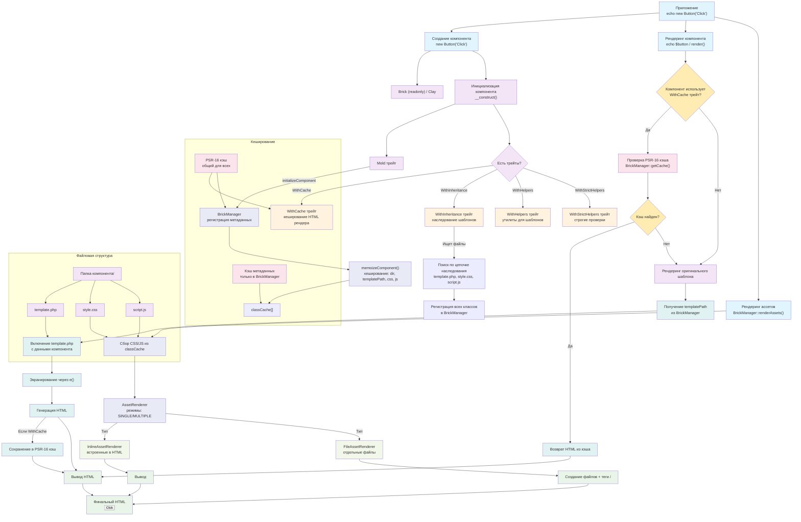

# Компоненты: Brick и Clay

Компоненты — это сердце библиотеки Brick. В этом разделе вы узнаете всё о создании, использовании и особенностях компонентов.

## Базовые концепции

### Что такое компонент Brick?

Компонент Brick — это **иммутабельный** PHP-объект, который:
- Хранит данные в публичных свойствах
- Автоматически рендерит HTML через шаблон
- Может иметь собственные CSS и JavaScript
- Гарантирует идентичный вывод для одинаковых входных данных

```php
// Компонент как функция: f(входные данные) = HTML
$button = new Button('Нажми', 'primary');
echo $button; // → <button class="btn btn-primary">Нажми</button>
```

### Brick vs Clay

| | Brick (рекомендуется) | Clay (особые случаи) |
|---|---|---|
| **Иммутабельность** | ✅ `readonly` класс | ❌ Мутабельный |
| **Безопасность** | ✅ Потокобезопасный | ⚠️ Требует осторожности |
| **Использование** | 95% случаев | 5% особых случаев |

**Правило:** Всегда используйте `Brick`. `Clay` — только для интеграции с legacy-кодом или сложного внутреннего состояния.

## Создание компонента

### Базовая структура

```
Alert/
├── Alert.php          # Класс компонента
├── template.php       # HTML шаблон
├── style.css          # Стили (опционально)
└── script.js          # JavaScript (опционально)
```

### Пример: Alert компонент

**Alert.php:**
```php
<?php
// Alert.php
readonly class Alert extends \OlegV\Brick
{
    public function __construct(
        public string $message,
        public string $type = 'info',
        public bool $dismissible = false
    ) {
        parent::__construct(); // Обязательно!
    }
}
```

**template.php:**
```php
<?php
// template.php
?>
<div class="alert alert-<?= $this->e($this->type) ?>" 
     role="alert"
     <?= $this->dismissible ? 'data-dismissible="true"' : '' ?>>

    <?php if ($this->dismissible): ?>
        <button type="button" class="close">&times;</button>
    <?php endif; ?>
    
    <div class="alert-content">
        <?= nl2br($this->e($this->message)) ?>
    </div>
</div>
```

## Жизненный цикл компонента

### 1. Создание (`new Component()`)
```php
$component = new Button('Текст', 'primary');
```

### 2. Инициализация
Библиотека автоматически:
1. Проверяет кэш `BrickManager`
2. Определяет директорию компонента
3. Находит `template.php` (обязательно)
4. Загружает `style.css` и `script.js` (если есть)
5. Регистрирует в `BrickManager`

### 3. Рендеринг
```php
// Явный рендеринг
$html = $component->render();

// Неявный рендеринг
echo $component; // Вызывает __toString() → render()
```

## Шаблоны (template.php)

### Синтаксис и лучшие практики

**✅ Правильно:**
```php
<?php
// Минимум логики, максимум отображения
?>
<div class="<?= $this->e($this->className) ?>">
    <h2><?= $this->e($this->title) ?></h2>
    <div class="content">
        <?= nl2br($this->e($this->content)) ?>
    </div>
</div>
```

**❌ Запрещено:**
```php
<?php
// Внешние зависимости и запросы в шаблонах
$user = User::find($this->userId);
$posts = $user->getRecentPosts(10);
// ... и т.д.
?>
```

### Доступные методы в шаблонах
- `$this->e(?string $value): string` — экранирование HTML

Из трейта `WithHelpers` (если используется):
- `$this->classList(array $classes): string`
- `$this->attr(array $attributes): string`
- `$this->date($date, string $format): string`
- И [много других](traits.md)

## Ассеты компонента

### CSS стили (`style.css`)
- Загружаются автоматически при существовании файла
- Можно использовать любые CSS функции
- Минифицируются, если включена настройка

```css
/* style.css */
.component {
    --primary-color: #007bff;
    padding: 1rem;
    border: 2px solid var(--primary-color);
}
```

### JavaScript (`script.js`)
- Загружаются автоматически при существовании файла

```javascript
// script.js
document.addEventListener('DOMContentLoaded', () => {
    console.log('Component initialized');
});
```

## Продвинутые паттерны

### Компоненты с коллекциями

```php
readonly class ProductList extends Brick
{
    /**
     * @param Product[] $products
     */
    public function __construct(
        public array $products,
        public int $columns = 3
    ) {
        parent::__construct();
    }
}
```

### Фабричные методы

```php
readonly class Notification extends Brick
{
    private function __construct(
        public string $message,
        public string $type
    ) {
        parent::__construct();
    }
    
    public static function success(string $message): self
    {
        return new self($message, 'success');
    }
}
```

### Вложенность компонентов

```php
readonly class ProductCard extends Brick
{
    public function __construct(
        public string $title,
        public float $price,
        public Button $buyButton // ← Композиция компонентов!
    ) {
        parent::__construct();
    }
}
```

## Архитектура



## Частые проблемы и решения

### "template.php не найден"
- Папка компонента должна иметь то же имя, что и класс
- `template.php` должен быть в папке компонента
- Всегда вызывайте `parent::__construct()`

### Изменения в CSS/JS не применяются
```php
// Очистите кэш
BrickManager::getInstance()->clear();
```

### Компонент рендерится медленно
1. Включите кэширование (`WithCache` трейт)
2. Настройте `AssetRenderer` на минификацию
3. Используйте `MODE_SINGLE` для объединения ассетов

---

**Далее:** Узнайте как расширить функциональность компонентов с помощью [трейтов](traits.md)